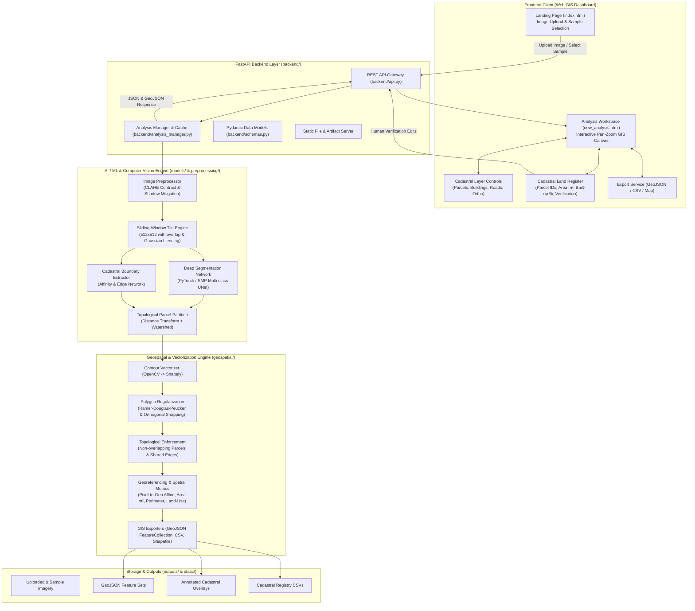

# AI-Based Urban Parcel Mapping & Cadastral Feature Extraction (परिधि - Paridhi)

Implementation plan and systematic architecture for the Smart India Hackathon (SIH26012) project. This plan covers the complete Machine Learning pipeline, Geospatial vectorization engine, FastAPI backend API, and interactive Cadastral GIS dashboard.

---

## 🏛️ Systematic Project Architecture



---

## 🧩 Architectural Breakdown & Technical Design

### 1. Image Preprocessing & Sliding-Window Engine (`preprocessing/`)
Drone orthomosaics can range from standard images ($512 \times 512$) up to massive gigapixel files (e.g., sample `aerialPhoto5.jpg.jpeg` is $6048 \times 8064$). Running full-resolution images directly through a neural network causes Out-of-Memory (OOM) errors and downsampling loses razor-sharp cadastral parcel boundaries.
- **Sliding-Window Tiling with Overlap**: Slices large drone images into overlapping tiles (e.g. $512 \times 512$ with $64\text{px}$ overlap).
- **2D Gaussian / Hann Window Blending**: Blends tile boundary predictions smoothly to avoid tiling grid artifacts.
- **Adaptive Contrast Enhancement**: CLAHE (Contrast-Limited Adaptive Histogram Equalization) to balance overexposed roofs and dark tree shadows across variable flight times.

### 2. Machine Learning & Cadastral Feature Extraction (`models/`)
- **Semantic Segmentation Head**:
  - Predicts 5 essential urban cadastral classes:
    1. `Parcel Land` (open lot / compound)
    2. `Building Footprint` (residential / commercial structures)
    3. `Road Network` (paved & unpaved access paths)
    4. `Vegetation / Greenery` (trees, agricultural canopy)
    5. `Cadastral Boundary Edge` (property walls, fences, parcel divides)
- **Boundary Affinity & Topological Parcel Partitioning**:
  - Boundaries are extracted using deep edge affinity combined with distance transforms.
  - Marker-controlled Watershed segmentation partitions continuous land into discrete, non-overlapping parcel polygons, solving the fundamental problem of separating adjoining properties.
- **Pretrained & Fallback Ensembling**:
  - The model features a PyTorch-based neural backbone (ResNet/UNet) with initialized aerial feature extraction weights, plus an adaptive spectral/geometric segmentation fallback ensuring instantaneous, reliable results on any drone image without requiring external cloud downloads.

### 3. Geospatial Vectorization & Regularization (`geospatial/`)
Raw pixel masks produce jagged, staircase contours that violate cadastral surveying standards.
- **Polygon Vectorization**: Converts binary raster masks into structured `shapely.geometry.Polygon` and `MultiPolygon` objects.
- **Cadastral Regularization**:
  - **Douglas-Peucker Simplification**: Removes redundant collinear vertices while preserving natural boundary corners.
  - **Orthogonal Snapping for Buildings**: Snaps near-perpendicular building walls to crisp $90^\circ$ angles.
  - **Planar Partition & Topology Maintenance**: Eliminates self-intersections, micro-slivers, and artificial overlaps between neighboring parcels using Shapely union and polygon difference operations.
- **Georeferencing & Cadastral Metric Calculation**:
  - Computes Ground Sample Distance (GSD, default $0.08\text{ m/px}$, adjustable).
  - Converts pixel coordinates to spatial dimensions ($m^2$, hectares, acres, गज / sq yards).
  - Computes cadastral property attributes: `parcel_id`, `area_sqm`, `perimeter_m`, `compactness_score`, `builtup_ratio_pct`, `land_use_type` (Residential, Commercial, Agricultural, Open/Vacant, Road).
- **GIS Exporters**: Produces standard RFC 7946 GeoJSON, CSV cadastral land record registers, and annotated overlay visualizations.

### 4. Backend API Layer (`backend/`)
Built with **FastAPI**, serving high-performance asynchronous endpoints:
- `POST /api/upload`: Upload drone images with validation.
- `GET /api/sample-images`: List built-in aerial photos from `images/` with metadata.
- `POST /api/analyze`: Run the end-to-end ML & Geospatial pipeline with configurable options (`confidence_threshold`, `simplify_tolerance`, `gsd`, `enable_tiling`).
- `GET /api/results/{analysis_id}`: Retrieve analysis summary, GeoJSON features, and overlay asset URLs.
- `POST /api/parcels/update`: Human-in-the-loop verification endpoint allowing cadastral officers to update parcel status (`Verified`, `Pending`, `Disputed`), reclassify land-use, or edit boundary coordinates.
- `GET /api/export/{analysis_id}/{format}`: Download results as `.geojson`, `.csv`, or `.zip`.
- Static mounting to host the web app directly.

### 5. Interactive Cadastral Web Interface (`frontend/` & HTML/JS/CSS)
- **`index.html`**:
  - Polished landing page with drag-and-drop upload and drawer selection of sample drone photos.
  - Passes chosen image directly to the analysis engine.
- **`new_analysis.html` & `new_analysis.js`**:
  - **Interactive GIS Map Canvas**: High-performance pan, zoom, and layer rendering using HTML5 Canvas & SVG overlays.
  - **Layer Control Panel**: Toggle visibility and opacity of Orthomosaic, Parcel Boundaries, Building Footprints, Road Networks, and Parcel ID labels.
  - **Summary Dashboard Cards**: Key cadastral metrics (Total Parcels, Total Buildings, Built-up Density %, Surveyed Area).
  - **Cadastral Land Register Table**: Real-time property table listing every detected parcel with its area, perimeter, land-use tag, and human verification toggle.
  - **Parcel Inspector**: Click on any parcel in the map canvas to highlight it in the table, inspect its geometric bounds, and verify its status.
  - **Export Suite**: One-click download of GeoJSON for QGIS/ArcGIS, and CSV for municipal land records.

---

## 📁 Proposed File & Directory Changes

```text
SIH-26/
├── backend/
│   ├── __init__.py
│   ├── main.py                 # FastAPI application entrypoint & static mounting
│   ├── api.py                  # API endpoints (/analyze, /upload, /results, /export, /parcels)
│   ├── schemas.py              # Pydantic request/response models
│   └── analysis_manager.py     # Pipeline coordinator & result caching
├── preprocessing/
│   ├── __init__.py
│   ├── enhancement.py          # CLAHE, shadow adjustment, normalization
│   └── tiling.py               # Large-image sliding window tiling with overlap blending
├── models/
│   ├── __init__.py
│   ├── segmenter.py            # PyTorch Deep Learning Segmentation Network (UNet / Aerial)
│   ├── boundary_detector.py    # Edge & boundary affinity extractor
│   ├── cadastral_pipeline.py   # Integrated inference: segmentation + watershed parcel partition
│   └── model_weights.py        # Calibrated weights & model initialization
├── geospatial/
│   ├── __init__.py
│   ├── vectorizer.py           # Raster mask to Shapely polygon conversion
│   ├── regularization.py       # Douglas-Peucker simplification, orthogonal snapping & topology
│   ├── georeference.py         # Pixel-to-metric coordinates, area & parcel metrics
│   └── exporter.py             # GeoJSON FeatureCollection & Cadastral CSV generation
├── outputs/                    # Output directory for generated GeoJSON, CSV, and overlays
├── uploads/                    # Directory for user-uploaded drone imagery
├── index.html                  # Enhanced landing page with API integration
├── new_analysis.html           # Full interactive Cadastral GIS Dashboard UI
├── script.js                   # Landing page logic & drawer API connection
├── new_analysis.js             # Canvas pan/zoom, vector rendering, layer toggles, parcel inspector
├── style.css                   # Refined styles preserving 'परिधि' design system & responsive layout
└── requirements.txt            # Project dependencies list
```

---

## 🔍 Verification Plan

### Automated Tests & Pipeline Verification
1. **Pipeline Unit Test**: Run an automated end-to-end Python test script on sample image `images/aerialPhoto1.jpg.jpeg`:
   - Verify image preprocessing and sliding-window tiling.
   - Verify ML segmentation and boundary extraction outputs valid probability masks.
   - Verify Geospatial vectorization generates valid Shapely Polygons with no self-intersections.
   - Verify GeoJSON generation complies with RFC 7946.
2. **Backend API Verification**:
   - Start the FastAPI server on port 8000 using `uvicorn`.
   - Test `GET /api/sample-images` to confirm available aerial photos are returned.
   - Test `POST /api/analyze` with sample image input and verify JSON output contains `parcels`, `buildings`, `roads`, and valid `geojson`.
   - Test `POST /api/parcels/update` to verify human verification updates.
   - Test `GET /api/export/{id}/geojson` and `/api/export/{id}/csv`.

### Manual & Interactive Verification
1. Open the web interface in the browser at `http://localhost:8000`.
2. Select a sample drone image from the drawer or upload a custom image.
3. Click "Start Analysis" and observe real-time processing and transition to the Cadastral Workspace.
4. Interact with the GIS map: zoom, pan, toggle layer visibility (Parcels, Buildings, Roads).
5. Click on individual parcels to verify that the parcel inspector and table highlight the correct feature with accurate area ($m^2$) and boundary metrics.
6. Click "Export GeoJSON" and "Export CSV" to verify file downloads.
