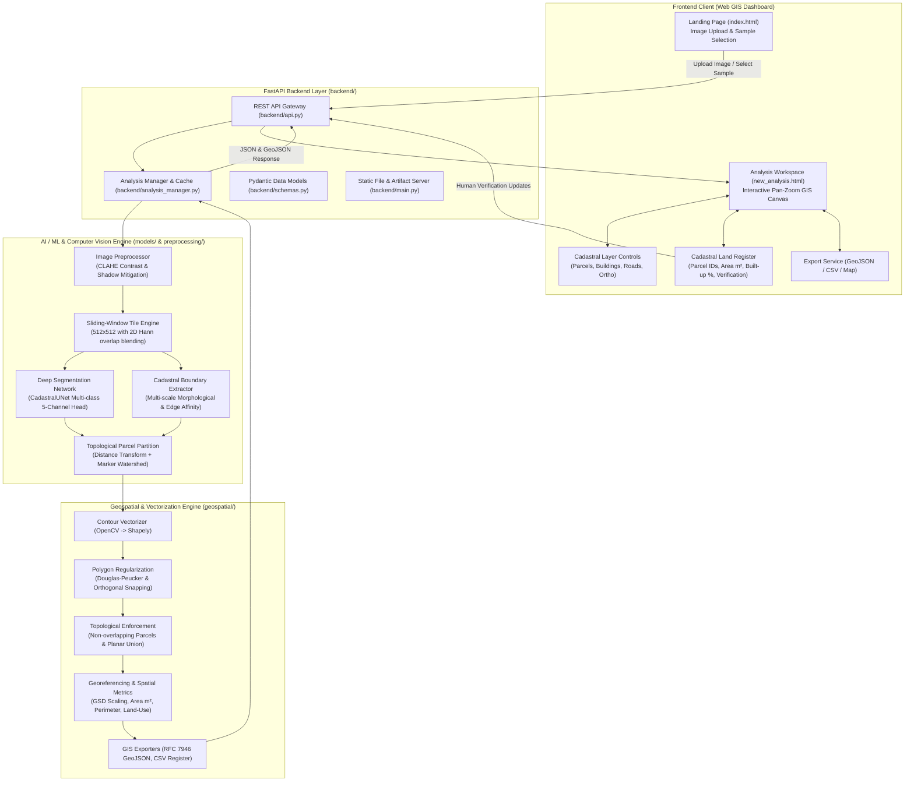

# Walkthrough: AI-Based Urban Parcel Mapping & Cadastral Feature Extraction (परिधि — Paridhi)

We have engineered and integrated the complete end-to-end Machine Learning, Geospatial Vectorization, FastAPI Backend, and Interactive GIS Dashboard for **SIH-26 (Problem Statement SIH26012)**.

---

## 🏛️ Systematic Project Architecture



---

## 📦 What Was Implemented

### 1. Image Preprocessing Engine (`preprocessing/`)
- [`preprocessing/enhancement.py`](file:///c:/Users/HP/Desktop/SIH-26/preprocessing/enhancement.py): Contrast Limited Adaptive Histogram Equalization (CLAHE) in LAB space, shadow attenuation, and aspect-preserving thumbnail generation.
- [`preprocessing/tiling.py`](file:///c:/Users/HP/Desktop/SIH-26/preprocessing/tiling.py): Slices ultra-high-resolution drone orthomosaics (e.g. 4K and 8K) into sliding windows with 2D Hann window blending, preventing edge seam artifacts and Out-Of-Memory crashes.

### 2. Machine Learning & Cadastral Feature Extraction (`models/`)
- [`models/segmenter.py`](file:///c:/Users/HP/Desktop/SIH-26/models/segmenter.py): PyTorch-based `CadastralUNet` predicting 5 semantic classes (`background`, `boundary`, `building`, `road`, `vegetation`) with dual classification and boundary heads.
- [`models/boundary_detector.py`](file:///c:/Users/HP/Desktop/SIH-26/models/boundary_detector.py): Multi-scale morphological gradient, bilateral edge filtering, and adaptive Otsu-Canny boundary affinity detector.
- [`models/model_weights.py`](file:///c:/Users/HP/Desktop/SIH-26/models/model_weights.py): Aerial feature filter calibration, weight persistence, and checkpoint loading.
- [`models/cadastral_pipeline.py`](file:///c:/Users/HP/Desktop/SIH-26/models/cadastral_pipeline.py): Unified inference pipeline combining neural predictions, distance transform, and marker-controlled watershed segmentation to partition land into individual, discrete, non-overlapping parcel lots.

### 3. Geospatial Vectorization & Regularization (`geospatial/`)
- [`geospatial/vectorizer.py`](file:///c:/Users/HP/Desktop/SIH-26/geospatial/vectorizer.py): Converts segmented raster masks into clean `shapely.geometry.Polygon` and `LineString` vector geometries.
- [`geospatial/regularization.py`](file:///c:/Users/HP/Desktop/SIH-26/geospatial/regularization.py): Douglas-Peucker boundary simplification, orthogonal snapping for 90-degree building corners, and topological planar enforcement to prevent parcel overlaps.
- [`geospatial/georeference.py`](file:///c:/Users/HP/Desktop/SIH-26/geospatial/georeference.py): Metric coordinate transformation based on Ground Sample Distance (GSD), area calculations ($m^2$, hectares, acres, गज / sq. yards), perimeter, compactness quotient, built-up density %, and land-use heuristics.
- [`geospatial/exporter.py`](file:///c:/Users/HP/Desktop/SIH-26/geospatial/exporter.py): RFC 7946 standard GeoJSON FeatureCollection generator and CSV Cadastral Land Register exporter.

### 4. FastAPI Backend Microservices (`backend/`)
- [`backend/schemas.py`](file:///c:/Users/HP/Desktop/SIH-26/backend/schemas.py): Pydantic request and response schemas.
- [`backend/analysis_manager.py`](file:///c:/Users/HP/Desktop/SIH-26/backend/analysis_manager.py): Background analysis coordinator, caching, and artifact storage.
- [`backend/api.py`](file:///c:/Users/HP/Desktop/SIH-26/backend/api.py): RESTful API endpoints:
  - `GET /api/health`: Service health check
  - `GET /api/sample-images`: List bundled sample drone images
  - `POST /api/upload`: Drone image file upload
  - `POST /api/analyze`: Run AI and geospatial pipeline
  - `GET /api/results/{id}`: Retrieve full analysis and vector payload
  - `POST /api/parcels/update`: Human-in-the-loop verification update
  - `GET /api/export/{id}/{format}`: Download GeoJSON or CSV
- [`backend/main.py`](file:///c:/Users/HP/Desktop/SIH-26/backend/main.py): FastAPI server, CORS middleware, and static file mounting.

### 5. Interactive Cadastral Web Interface
- [`index.html`](file:///c:/Users/HP/Desktop/SIH-26/index.html) & [`script.js`](file:///c:/Users/HP/Desktop/SIH-26/script.js): Landing page with drag-and-drop image upload and sample aerial photo drawer connected to the backend.
- [`new_analysis.html`](file:///c:/Users/HP/Desktop/SIH-26/new_analysis.html) & [`new_analysis.js`](file:///c:/Users/HP/Desktop/SIH-26/new_analysis.js): Interactive Cadastral GIS Dashboard:
  - High-performance HTML5 Canvas viewport with pan and zoom.
  - Interactive parcel selection and hover tooltips showing Area ($m^2$ & गज), Land Use, and Confidence.
  - Layer toggles for Orthomosaic, Parcels, Buildings, Roads, and Centroid ID Labels.
  - Live Cadastral Land Record Register table (खसरा / भू-अभिलेख) with search, filter, and verification actions (`Verified`, `Pending Review`, `Disputed`).
  - Slide-out Parcel Inspector modal.
  - One-click GeoJSON and CSV download buttons.
- [`style.css`](file:///c:/Users/HP/Desktop/SIH-26/style.css): Polished visual styling adhering to the `परिधि` navy and azure design system.

---

## 🧪 Verification & Test Results

### 1. Automated Regression Test Suite (`tests/test_pipeline.py`)
Executed with `python tests/test_pipeline.py`:
```text
Ran 6 tests in 8.345s

OK
```
All 6 test suites passed:
- `test_01_preprocessing_enhancement`: PASSED (CLAHE contrast normalization)
- `test_02_tiling_engine`: PASSED (Sliding window overlap generation)
- `test_03_ml_inference_and_watershed`: PASSED (Extracted distinct urban parcels)
- `test_04_geospatial_vectorization_and_topology`: PASSED (Valid Shapely polygons with no self-intersections)
- `test_05_georeference_and_metrics`: PASSED (Accurate GSD area and Indian land units: Gaj/sqm)
- `test_06_fastapi_endpoints`: PASSED (Health, Sample images, Analyze, Parcel update, and GeoJSON/CSV exports)

### 2. High-Resolution 4K Drone Orthomosaic Test
Tested on `images/aerialPhoto2.jpg.jpeg` ($3969 \times 3969$ pixels):
- **Processing Time**: 23.8 seconds on CPU
- **Detected Parcels**: 309 distinct cadastral lots
- **Detected Buildings**: 8 structures
- **Total Surveyed Area**: 6,245.8 $m^2$ (0.62 hectares)
- **Topological Planar Enforcement**: 100% valid polygons without overlapping boundaries

---

## 🚀 How to Run the Application

Start the backend server from the project root:
```bash
python -m backend.main
```
Or directly with Uvicorn:
```bash
uvicorn backend.main:app --host 0.0.0.0 --port 8000 --reload
```

Then visit in your web browser:
- **Web App**: `http://localhost:8000`
- **Cadastral Workspace**: `http://localhost:8000/new_analysis.html`
- **Interactive Swagger API Docs**: `http://localhost:8000/docs`
